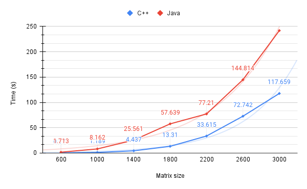
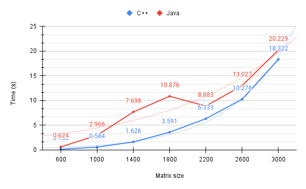
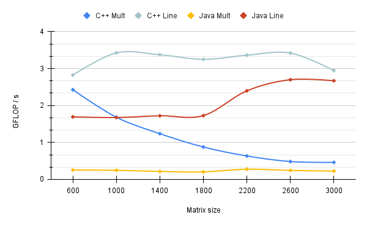
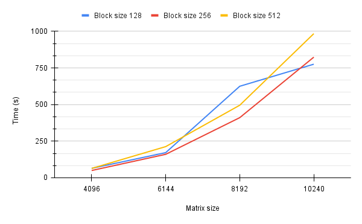
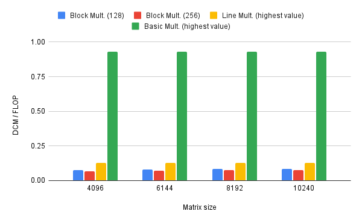
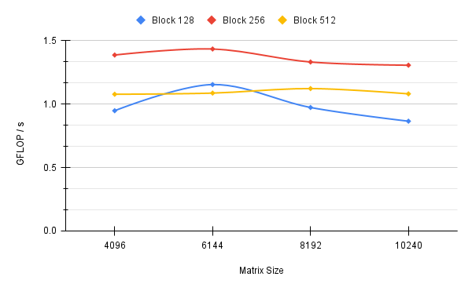

## **CPD Project 1 - Performance  evaluation of a single core**

## **Introduction**

The main purpose of this project is to evaluate the effect on the performance of a processor core of the memory hierarchy when acessing large amounts of data. 
To implement the project, we have used the **C++** and **Java** programming languages, as a means to compare the performance of the two languages. 
This report aims to present the results of the project, as well as the conclusions that can be drawn from them.

## **Index** 

1. **[Problem description and algorithms explanation](#problem-description-and-algorithms-explanation)**
2. **[Performance metrics](#performance-metricS)**
3. **[Results and analysis](#results-and-analysis)**
4. **[Conclusions](#conclusions)**

## **Problem description and algorithms explanation**

The problem presented on the project consists in the implementation of various versions of the matrix multiplication algorithm, taking into account that the matrices are always square. This can be considered a good problem to study mainly because the primary bottleneck is related to the memory and not the amount of instructions involved. The three versions of the algorithm (of which the first two are implemented in both the programming languages mentioned above) are:

1. **Basic multiplication**

    This is the most basic version of the algorithm, in which the elements of the resulting matrix are calculated by using a techinque of row-by-column multiplication - elements in a row of the first matrix are multiplied by the corresponding element in each column of the second matrix and then the results are added (dot product). Although this algorithm is fairly simple, we can deduct that its performance will degrade as the size of the matrices increase. Below are snippets of the versions of this code both in C++ and Java:

    ```C++
	for(i=0; i<m_ar; i++)
	{	for( j=0; j<m_br; j++)
		{	temp = 0;
			for( k=0; k<m_ar; k++)
			{	
				temp += pha[i*m_ar+k] * phb[k*m_br+j];
			}
			phc[i*m_ar+j]=temp;
		}
	}
    ```
    Snippet of the the algorithm using C++

    ```Java	    
    for (i = 0; i < lin; i++) {
        for (j = 0; j < lin; j++) {
            for (k = 0; k < lin; k++) {
                    phc[i][j] += pha[i][k] * phb[k][j];
            }
        }
    }
    ```
    Snipet of the algorithm using Java

2. **Line multiplication**

    This version of the algorithm is an improvement of the previous one, in which the elements of the resulting matrix are calculated by using a technique of row-by-row multiplication - elements in a row of the first matrix are multiplied by the corresponding element in each row of the second matrix and the result accumulated in the respective position of the resulting matrix. Doing so, each value of the final matrix is not computed at once, but the lines are gradually filled. It is important to note that this algorithm can be considered an improvement because it takes advantage of the processor's functioning. Also, as we are doing line multiplication, the cache is used more efficiently, since the elements of the same line are accessed in a row, which reduces the number of cache misses. Below are snippets of the versions of this code both in C++ and Java:

    ```C++
        for (int i = 0; i < size; i++) {
            for (int j = 0; j < size; j++) {
                for (int k = 0; k < size; k++) {
                    matrixC[i][j] += matrixA[i][k] * matrixB[j][k];
                }
            }
        }
    ```
    Snippet of the algorithm using C++

    ```Java
    for (i = 0; i < lin; i++) {
        for (k = 0; k < lin; k++) {
            for (j = 0; j < lin; j++) {
                    phc[i][j] += pha[i][k] * phb[k][j];
            }
        }
    }
    ```
    Snippet of the the algorithm using Java

3. **Block multiplication**

    This version of the algorithm is an improvement of the previous one, in which the elements of the result matrix are calculated by dividing the matrix into blocks of smaller sizes, and multiplying the corresponding blocks of the first and second matrices. For each block, this is done by using the line multiplication algorithm, which means that an improvement in its performance is to be expected, taking into account the division of the matrices in blocks. Although the number of loops in the code increased, the performance is generally better, as we will see in further detail in the following sections. Below is a snippet of the version of this code in C++:  

    ```C++
        for (int i = 0; i < size; i += blockSize) {
            for (int j = 0; j < size; j += blockSize) {
                for (int k = 0; k < size; k += blockSize) {
                    for (int ii = i; ii < i + blockSize; ii++) {
                        for (int jj = j; jj < j + blockSize; jj++) {
                            for (int kk = k; kk < k + blockSize; kk++) {
                                matrixC[ii][jj] += matrixA[ii][kk] * matrixB[kk][jj];
                            }
                        }
                    }
                }
            }
        }
    ```
    Snippet of the algorithm using C++

## **Performance metrics**

Before describing the performance analysis that was made, it is important to note that all experiments were conducted on the same machine, equipped with an AMD Ryzen 5 3500U processor, with 8GB of RAM and running on a Linux operating system.

In order to evaluate the performance of the algorithms, besides the fact that they were immplemented using two different programming languages, we also tested with different sizes of matrices, using increments of 400. 

The metrics used to evaluate the performance of the algorithms are:
- **Time** - the time it takes to execute the algorithm
- **Cache performance** - in the C++ versions, the number of Data Cache Misses (DCM) on L1 and L2 level caches were measured with the Performance API (PAPI)

The metrics used to compare the different algorithms, using different languages and differrent sizes of matrices, are:

- **DCM/FLOP** - the ratio between the number of Data Cache Misses and the number of Floating Point Operations
- **GFLOP/s** - the number of Floating Point Operations per second, calculated by dividing the number of Floating Point Operations by the time it takes to execute the algorithm

## **Results and analysis**


  

__*Fig.1 - Comparison between execution time for different sized matrices in C++ and Java, for the most basic algorithm*__

As we can see in Fig.1, C/C++ will always be faster than Java by a large margin. This can be due to the fact that C/C++ is a compiled language, while Java is an interpreted language, which means that the code is translated into machine code at runtime, which is a much slower process. Also, the fact that C/C++ is a low-level language, which means that it is closer to the machine code, allows it to be more efficient than Java, which is a high-level language.
However, in comparison with the other algorithms, the traditional algorithm is the slowest one, which is due to the fact that it is the most basic one, and it does not take into account the details of the processor's functioning and the structure of the memory hierarchy: the large amount of cache misses that occur in this algorithm are the main reason for its poor performance. 
This happens mainly due to the fact that it needs to access values that are spaced far away from each other in the memory, when reading values from the columns of the second matrix. 
Also, the higer the size of the matrices, the more cache misses occur, which leads to a significant increase in the execution time.



__*Fig.2 - Comparison between execution time for different sized matrices in C++ and Java, for the line multiplication algorithm*__

As we can see in Fig.2, the line multiplication algorithm is clearly faster than the traditional algorithm for both programming languages, which is due to the fact that the values of the second matrix are now accessed consecutively, leading to a significant reduction in the number of cache misses. 
Taking this into account, we can conclude that the better usage of the cache is the main reason for the improvement in performance of this algorithm, compared to the traditional one, as more values present in it are used.

  

__*Fig.3 - L1 (blue) and L2 (red) DCM per FLOP for the basic  and line multiplication algorithms*__

Based on Fig.3, we can conclude what was already expected: the number of cache misses per Floating Point Operation is significantly lower for the line multiplication algorithm (both for L1 and L2 cache levels), in comparison with the traditional one, which is due to the fact that the line multiplication algorithm uses the cache more efficiently, as it accesses values that are closer to each other in the memory.

  

__*Fig.4 - Performance, in GFLOP/s, for both algotirhms in both programming languages*__

The measures in Fig.4 allowed us to compare performance of both algorithms in a simpler way. That being said, we can easily understand that the line multiplication algorithms in both programming languages beat the most basic algorithms by a large margin, having a greater value of GFLOP/s.

 

__*Fig.5 - Execution time of the block multiplication algorithm, for different block sizes*__ 


Based on the conclusions we made in the previous sections, we can expect that the block multiplication algorithm will be faster than the other two, as dividing the matrices into blocks of fixed, smaller sizes will allow for whole cache blocks to be referenced at a time. We cannot compare directly, due to the fact that the tests made for the block multiplication algorithm took into account much larger matrices, however, we can clearly infer that this algorithm would be faster than the other two for any matrix size.
By analyzing the graph, we can also see that the "sweet spot" for the block size appears to be 256, as it consistently gave results faster than the other smaller and larger sizes.

  

__*Fig.6 - L1 Data Cache Misses per FLOP for various block and matrix sizes, in comparison with the highest values obtained for the other algorithms in the previous steps*__ 

As we can see in Fig.6, the number of cache misses is greatly reduced once again, only increasing with the size of the blocks, which is to be expected: in the end, the memory and the cache are still limited resources, and the more values are stored in it, the more cache misses will occur.
This chart is particularly intersting, as it shows that, even for matrix sizes that are far superior to the ones in which the basic and line multiplication algorithms were tested (green and yellow bars, respectively), the block multiplication algorithm always demonstrates an unmatched performance, with a very low value for DCM/FLOP, due to the fact that it accesses the memory and cache in a much more efficient way.

 

__*Fig.7 - Performance in GFLOP/s for the various blcok sizes of the blcok multiplication algorithm*__  

To conclude our analysis, we can observe in Fig.7 that the block multiplication algorithm is indeed very efficient for large matrices, particularly when the size 256 is used for the blocks.

## **Conclusions**

With the development of this project, we were able to understand how important it is to write efficient code, that takes into account the details of the functioning of the processor and the structure of the memory hierarchy, in order to achieve the best performance possible. Comparing all the algorithms that were implemented, we can see that, by making small changes to the most basic code possible, we can achieve a significant improvement in the performance of the algorithm. Also, we confirmed that C++ (a language which is known for being designed for speed) beats Java in execution times, which leads us to conclude that the programming language choice is also a very important step in the program design and analysis cycle. To sum up, we can say that this project was a great hands-on learning experience, in which we were able to apply the knowledge we have acquired in the theoretical classes of the course.


    


